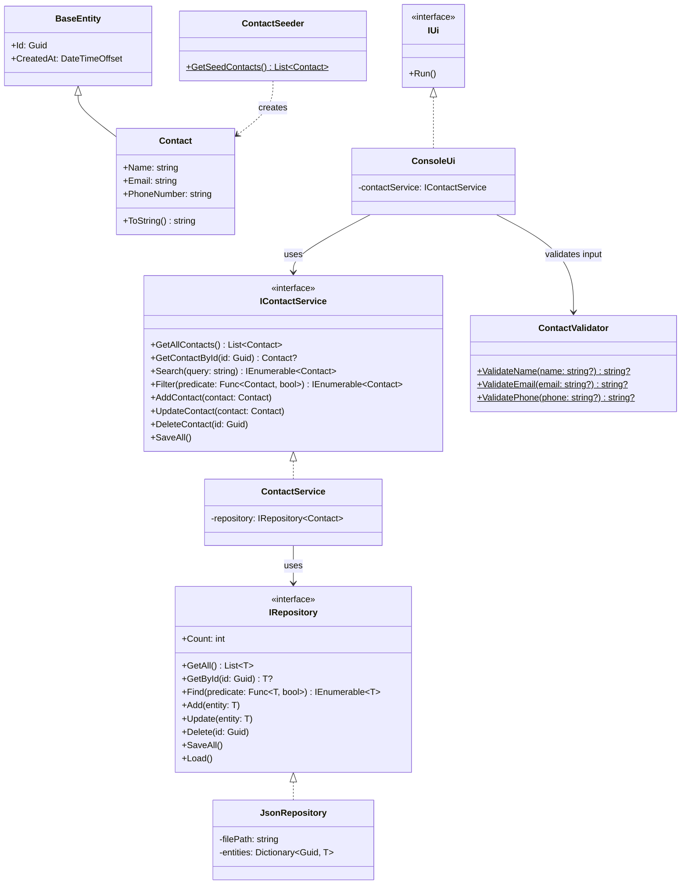

# Contact Manager CLI

## Contents

- [Overview](#overview)
- [Class Diagram](#class-diagram)
- [How to Run](#how-to-run)

## Overview

A simple command-line contact management app built with .NET 10. Supports CRUD operations, searching, and filtering contacts using JSON for persistance.

**Features:**
- Add, edit, delete, and view contacts
- List all contacts
- Search across name, email, and phone number
- Filter contacts by a specific field
- Load and save contacts from/to a JSON file, saves data to `contacts.json` in the project directory (.json files are not pushed to the repository).

## Class Diagram



**Notes:**

- `BaseEntity` holds `Id` and `CreatedAt`, both auto-generated on creation. Any entity added to app should inherit from it.
- `IRepository<T>` is the generic interface exposed by the persistance layer, it can store any entity that inherits from `BaseEntity`. This makes swapping different implemenations simple.
- `ContactSeeder` provides sample data when no file is specified to load the data.
- `ContactValidator` uses Regex to validate email and phone input.

## How to Run
> **Prerequisites**: .NET 10 SDK

**1. Clone the repo and navigate to it**
```bash
git clone https://github.com/your-username/ContactManagerCLI.git
cd ContactManagerCLI
```

**2. Build**
```bash
dotnet build
```

**3. Run**
```bash
dotnet run --project ContactManagerCLI/ContactManagerCLI.csproj
```
