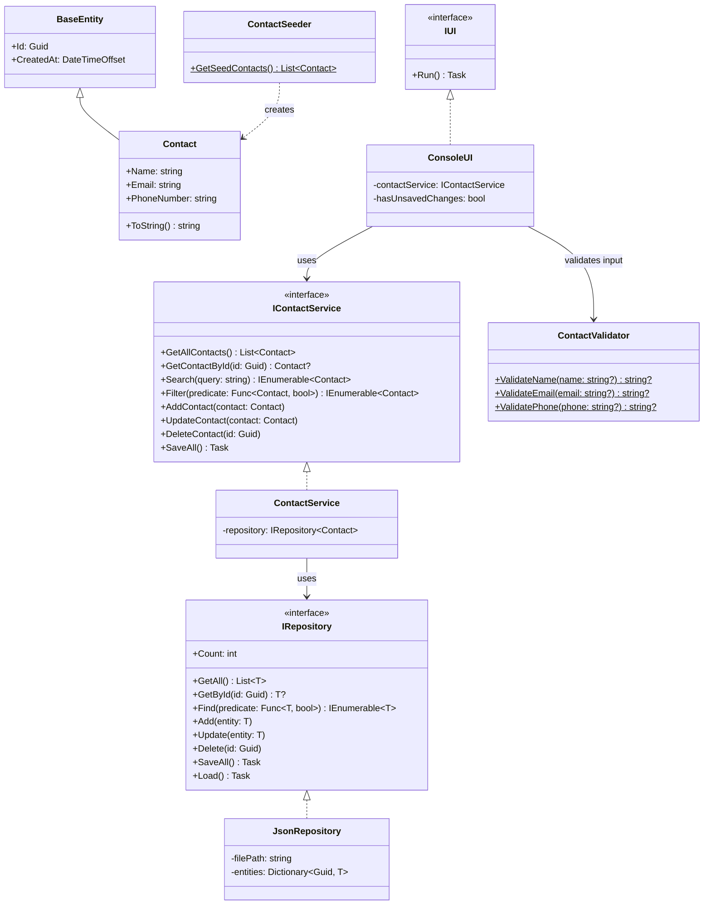

# Contact Manager CLI

## Contents

- [Overview](#overview)
- [Class Diagram](#class-diagram)
- [How to Run](#how-to-run)

## Overview

A simple command-line contact management app built with .NET 10. Supports CRUD operations, searching, and filtering contacts using JSON for persistance.

**Features:**
- Add, edit, delete, and view contacts
- List all contacts
- Search across name, email, and phone number
- Filter contacts by a specific field
- Non-blocking I/O for loading and saving data
- Persist contacts to JSON files in the executable directory (e.g., `bin/Debug/net10.0/contacts.json`)

## Class Diagram



**Design Principles:**
- **Dependency Inversion** — layers depend on abstractions (`IRepository`, `IContactService`, `IUI`) not implementations
- **Single Responsibility** — each class has one clear purpose (repository for persistence, service for business logic, UI for presentation)
- **Open/Closed** — new entities can be added by extending `BaseEntity` without modifying `JsonRepository<T>`; new repository types (e.g., SQL, XML) can be swapped in without affecting other layers by implementing `IRepository`.
- **Separation of Concerns** — data, business logic, and presentation are cleanly separated

**Notes:**

- `BaseEntity` holds `Id` and `CreatedAt`, both auto-generated on creation. Any entity added to app should inherit from it.
- `ContactSeeder` provides sample data when no file is specified to load the data.
- `ContactValidator` uses Regex to validate email and phone input.

## How to Run
> **Prerequisites**: .NET 10 SDK

**1. Clone the repo and navigate to it**
```bash
git clone https://github.com/your-username/ContactManagerCLI.git
cd ContactManagerCLI
```

**2. Build**
```bash
dotnet build
```

**3. Run**
```bash
dotnet run --project ContactManagerCLI/ContactManagerCLI.csproj
```
